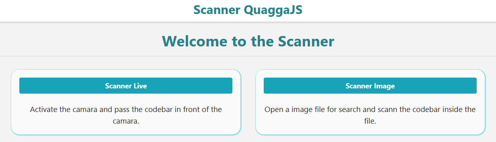
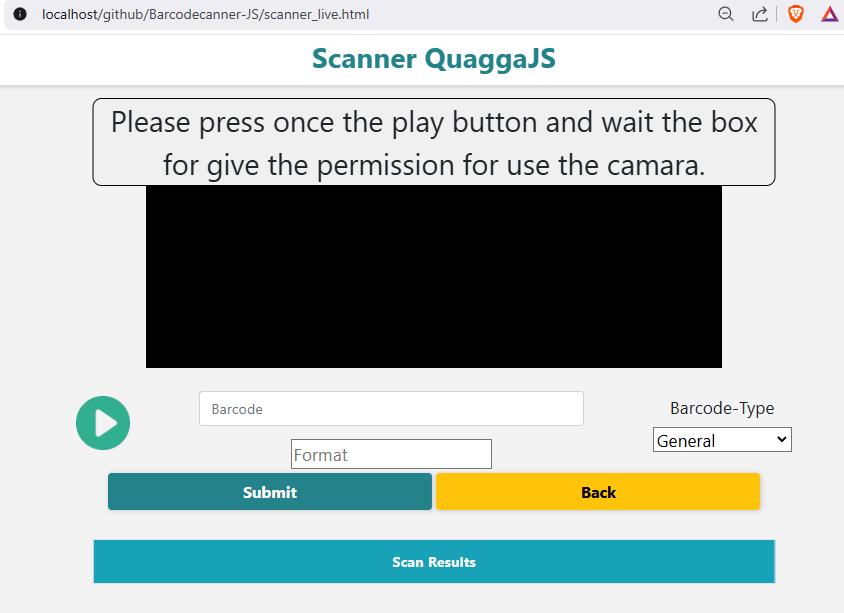
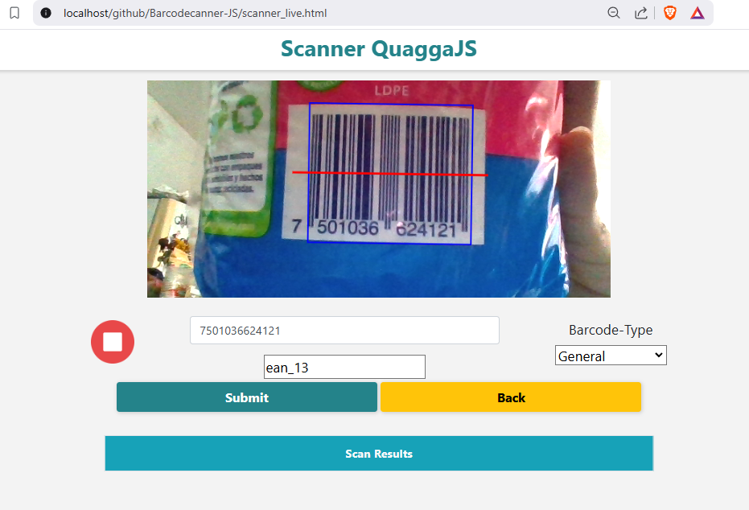
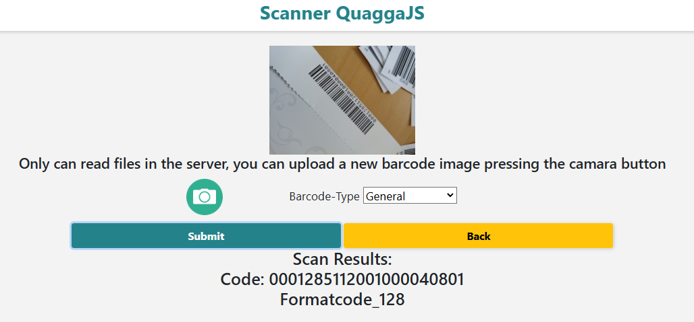
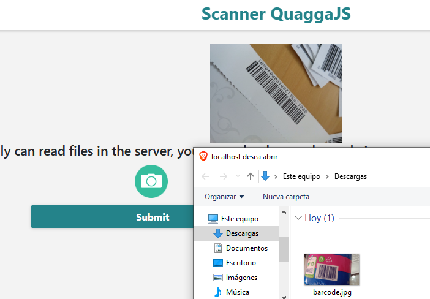
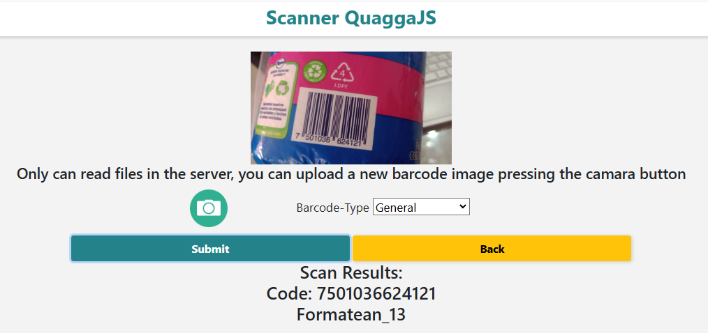

# Barcode Scanner

## Introducción

Escaner de código de barras, en este proyecto se hace uso de la libreria QuaggaJS

Se muestran 2 ejemplos, los cuales son: 
- Escaneo en vivo
- Escaneo por imagen

## Escaneo en vivo

Se prendera la camara del dispositivo e intentara escanear todo lo que pueda ser un código de barras.
Al detectar un código lo anotara en el input junto con el formato al que pertenece el código.

_Nota: Se necesita permiso de la camara y que el servidor tenga el protocolo https, tambien puede servir en localhost para pruebas._

### Ejemplo de uso

Al iniciar la página se debe aceptar permisos de usar la cámara.
Tambien se puede prender y apagar la cámara.

Comenzara a detectar los códigos de barra que encuentra.

Por defecto el lector que usa es el general, pero para mayor precisión se debe elegir el tipo de lector al que pertenen los códigos de barras que se van a escanear.

Para encontrar el tipo de lector, puedes usar esta página para escanearlo y cuando salga un resultado selecciona el formato que te aparecio debajo del código.

## Escaneo por imagen

Escanea una imagen guardada

Puedes cambiar la imagen haciendo clic en el botón de cámara.

Ahora escaneara la nueva imagen subida.

## QuaggaJS

El link de la libreria QuaggaJS es el siguiente,
puede consultarlo para mayor información acerca de esta libreria

https://serratus.github.io/quaggaJS/